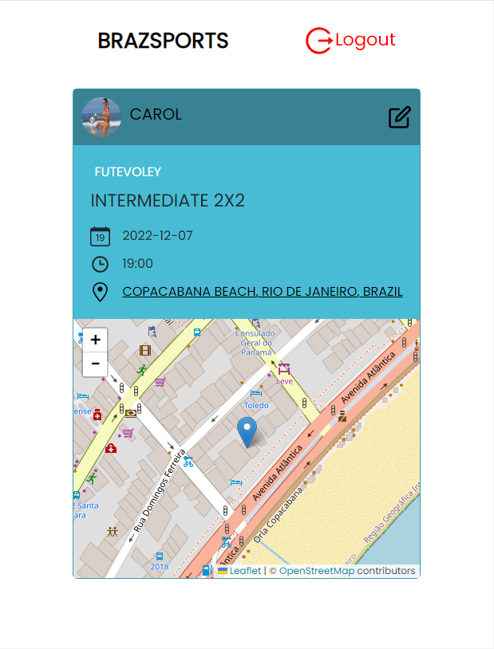

<h1 align="center">BRAZSPORTS</h1>

## Links Deploy

## 🌐✨ [BrazSports](https://brazsports.netlify.app)

## 💻🗄 [BackEnd deploy on Render](https://braz-sports-backend.onrender.com/players)

 

 

## About

Braz Sports is an open space for those who want to enjoy friendlies games around the city.
 
The application has a map library (Leaflet). It will allow the users to find quickly. Focusing on the best UX.
 
The idea of this application is to allow the organizer to publish their own events.
 
For each event you can Delete, Create and Update their publications (CRUD).
 

✨ Things to know

## BrazSports is a CRUD application

## Frontend:
- Simple Web Application

## Backend:
- RESTful API
- MondoDB

## Technologies

- [React](https://reactjs.org/)
- [React Hooks](https://reactjs.org/docs/hooks-intro.html)
- [React Router](https://reactrouter.com/web/guides/quick-start)
- [Redux](https://redux.js.org/)
- [Redux Thunk](https://github.com/reduxjs/redux-thunk)
- [Styled Components](https://styled-components.com/)
- [Netlify](https://www.netlify.com)
- [ExpressJS](https://expressjs.com)
- [NodeJS](https://nodejs.org/)
- [MongoDB](https://www.mongodb.com)
- [JWT](https://jwt.io)
- [Jest](https://jestjs.io)

## Back endpoints   

`🔹 POST ➡️ .../users/register`  
Register a user. The payload should have a name, an username and a password.

`🔹 POST ➡️ .../users/login`  
Login with an existing user to get a valid token. The payload should have an existing username and password.

`🔹 GET ➡️ .../users/:username`  
Get all the data of an existing user, including the notes created by him.

`🔹 GET ➡️ .../players`  
Get all the players.

`🔹 GET ➡️ .../players/:idPlayer`  
Get the players created by one user.

`🔹 POST ➡️ .../`  
Create a card player. The payload should have a name, a infos and a skills about the events.

`🔹 DEL ➡️ .../players/:idPlayer`  
Delete a card player with it's ID. A card player can be deleted.

`🔹 PUT ➡️ .../players/:idPlayer`  
Edit a card player with it's ID. A card player can be edited.
